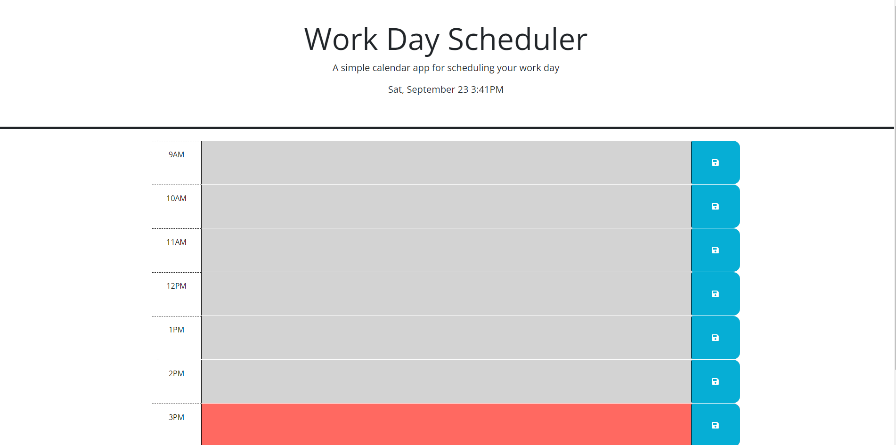

# Work-Day-Scheduler

## Description

This project was undertaken to add javascript logic to an existing page in order to make the blocks change color based on the current time, dislpaying whether it is in the past, current, or future. And to make any input saveable by the user and persist until deleted as well as add the current date to the header.

The project uses HTML, CSS, and Javascript although I was mainly responsible for the javascript portion as well as finishing the HTMl.

## Installation

N/A

## Usage

The page can be accessed via this link: https://loganlagrange.github.io/work-day-scheduler/

The page is used by entering tasks or events you have during particular time blocks of the day in the text field and clicking the save button. This will cause the text you entered to persist in that area until you delete it and again click save regardless of page reload. The page displays the date and time for ease of use and the blocks are color coded to make it easy to tell if they are upcoming or have already happened. 

## Credits
N/A

## License
See LICENSE in repo.